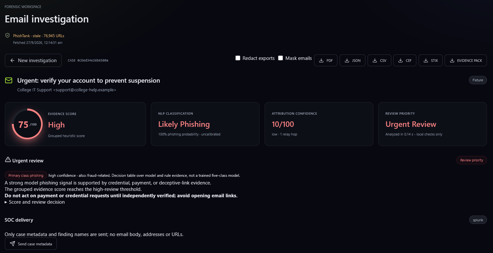
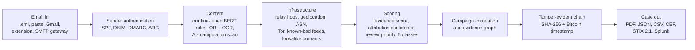

# PRAHARI

**Detect. Attribute. Prove.**

PRAHARI (Hindi for "sentinel") turns one suspicious email into an investigation case that an analyst can check, share and defend. Built by team **Cache-Me-Maybe** for Smart India Hackathon 2026, problem statement **SIH26106**: AI-Powered Email Threat Detection, Geo-Location and Forensic Intelligence Platform (Blockchain & Cybersecurity).

| | |
|---|---|
| Demo video | https://youtu.be/dK66yOoBQGY |
| Project report | [Google Doc](https://docs.google.com/document/d/1LuaA43Lfy4zs7mbN1wNIfCHvymSRNYwTX1ehnTPKw38/edit?usp=sharing) |
| Submitted idea deck | [`presentation/PRAHARI_SIH26106_submission.pdf`](presentation/PRAHARI_SIH26106_submission.pdf) |
| Technical report | [`docs/project-report.md`](docs/project-report.md) |



*A real screenshot of the running prototype, analysing one of its built-in sample emails.*

## Why we built it

Most email security tools answer one question: should this message be blocked? When a phishing or business email compromise (BEC) attack gets through, the investigator starts from scratch. Who really sent it? What infrastructure is behind it? Have we seen it before? Can the evidence be trusted weeks later? PRAHARI answers those questions for one email at a time, and links related emails into campaigns.

It traces **email infrastructure, not people**. Scores and classes are review aids for an analyst, not verdicts.

## What happens to one email



1. **It arrives** from an `.eml` upload, pasted source, Gmail push notifications, our Gmail Guard browser extension, or an SMTP gateway that checks mail before it reaches any inbox. All five use the same analysis engine.
2. **We check the sender** with SPF, DKIM, DMARC and ARC against live DNS. Anything that cannot be verified is shown as "not established", never as a pass.
3. **We read the content** with our own fine-tuned BERT model plus transparent rules (credential pressure, payment changes, urgency). It also reads text and QR codes hidden in images and PDFs, and detects hidden instructions aimed at AI assistants.
4. **We trace the infrastructure:** relay hops, IP location and network owner, Tor exit nodes, known botnet and hijacked-network lists, domain registration records, and lookalike domains of 33 Indian banks, government services and payment apps. Investigator leads say who to contact for a takedown (the registrar and network owner), never who the sender is.
5. **We score it three separate ways:** an evidence score (how worrying the signals are), attribution confidence (how far to trust the trace) and review priority (what to handle first), plus one of five classes: legitimate, suspicious, impersonated, phishing or fraud-related. Every flag shows its reason.
6. **We link it to other cases** through shared links, reply addresses, attachment hashes and similar wording.
7. **We seal it.** Case actions (analysis, notes, reviews, approvals, assignments, SIEM deliveries) go into a SHA-256 hash chain, and the chain head can be anchored to Bitcoin with OpenTimestamps. Editing any record breaks the chain.
8. **We export it** to PDF, JSON, CSV, CEF, STIX 2.1 and Splunk, with Aadhaar, PAN, UPI and mobile numbers masked.

## Our own phishing model

The language model inside PRAHARI is one we trained ourselves. We started from the public `bert-base-uncased` checkpoint and fine-tuned it on our own labelled dataset of phishing and legitimate emails:

- **356,836 emails collected, 335,264 after removing 21,572 duplicates**, split into 268,211 for training, 33,526 for validation and 33,527 held back for testing.
- **99.32% accuracy and a 0.49% false-positive rate** on the held-back test set (F1 0.993, ROC-AUC 0.9996).
- **We found and fixed a data leak before training.** Some source datasets came pre-split with copies of the same email on both sides, which would have inflated the score. We de-duplicated the whole pool and made a fresh split.
- **We attacked our own model, then fixed it.** Padding an email pushed the phishing text past the part BERT reads, so detection of that attack was 0 out of 100. The model now reads the whole email in overlapping windows: 95 out of 100 caught on the same attack ([`backend/local_model.py`](backend/local_model.py), [`training/adversarial_robustness_eval.py`](training/adversarial_robustness_eval.py)).
- **It is authentication-aware:** a scary-looking email from a cryptographically verified sender is not escalated on content alone.
- **We tested it outside our own data.** On public emails it never saw, it caught **98% of real 2025 phishing** (147 of 150) but also flagged **37% of legitimate 2003 mail** (111 of 300), mostly newsletters ([`benchmarks/external_evaluation.md`](benchmarks/external_evaluation.md)). That is why a model-only alert is treated as a lead for an analyst, not a verdict.
- It runs on an ordinary CPU inside the app, so no email text is sent to an outside AI service.

Training code: [`training/train_phishing_model.py`](training/train_phishing_model.py). The checkpoint and dataset are too large for git (see [Run locally](#run-locally)).

## Highlights

| What | Evidence |
|---|---|
| **808 automated backend tests** passing, plus 9/9 browser-extension tests | `python -m pytest backend` (re-run 2026-09-27) |
| **About 75 ms per email** locally (median, BERT loaded); 2 to 4 s with live lookups, about 50 ms once cached | [`benchmarks/`](benchmarks/) |
| **Bitcoin timestamp confirmed** in block 968372 for a real hash-chain head, re-verified against a public block explorer | [`demo/bitcoin_proof/`](demo/bitcoin_proof/) |
| **Court-ready evidence pack:** manifest, hashes, custody trail and a draft declaration for a human signer, to support a certificate under Section 63 of the Bharatiya Sakshya Adhiniyam, 2023 (it supports the certificate; it does not issue it) | [`backend/evidence_pack.py`](backend/evidence_pack.py) |
| **SOC controls:** viewer, analyst and admin roles, every audit event stamped with who did it, and a four-eyes rule so the analyst who ran a case cannot approve it | [`backend/authz.py`](backend/authz.py) |
| **Attribution confidence validated:** 17 of 17 labelled scenarios in the expected band, 13 of 13 ordering checks (ordering, not a calibrated probability) | [`benchmarks/attribution_validation_matrix.md`](benchmarks/attribution_validation_matrix.md) |
| **Invoice fraud inside a conversation:** flags when a reply in an existing thread changes the bank account or UPI ID, or switches the reply-to domain | [`backend/conversation.py`](backend/conversation.py) |
| **Looking at a link without clicking it:** describes a landing page (login forms, password fields, brand cues) without running its scripts, hardened against server-side request forgery | [`backend/landing_page.py`](backend/landing_page.py) |
| **Pre-delivery SMTP gateway** that holds high-risk mail before any mailbox, tested over real SMTP | [`backend/gateway.py`](backend/gateway.py) |
| **Live-checked integrations:** Gmail push on a real account, Splunk HEC delivery confirmed in a real Splunk index | [`docs/development-log.md`](docs/development-log.md) |
| **A security tool that checks itself:** SBOMs for backend (96 components) and frontend (59), 0 known vulnerabilities in a clean-install audit | [`security/`](security/) |
| **Built for Indian users:** Aadhaar (Verhoeff-validated), PAN, UPI and mobile masking in exports; Hindi renders correctly in PDF reports; Hindi and Hinglish text is flagged when it is outside the model's training | [`backend/pii.py`](backend/pii.py), [`backend/language_support.py`](backend/language_support.py) |
| **Accessibility:** automated WCAG 2.1 AA audit clean across 12 screens (run before the newest panels were added) | [`security/ACCESSIBILITY_AUDIT.md`](security/ACCESSIBILITY_AUDIT.md) |

Every number above comes from a file in this repository. Requirement-by-requirement status against the problem statement is in [`docs/acceptance-matrix.md`](docs/acceptance-matrix.md).

## Known limits

We would rather state these than have them found.

- **It traces infrastructure, not people.** It will not name an attacker; we don't think any honest tool can from email headers alone.
- **The model over-flags newsletters** (37% of a 2003 legitimate-mail sample). The fix is retraining on modern legitimate mail, which is our next step. The 99.32% figure is a held-out split from the same data distribution, not a real-world guarantee.
- **The five-class output** is a documented decision table over model, authentication and rule evidence, not a separately trained model.
- **Open-relay detection is not offered** (it needs active probing). VPN and proxy hints need an optional AbuseIPDB key.
- **OCR reads English and Latin script only.** Link inspection is static; pages are not rendered in a browser.
- **The SMTP gateway** is a model for an organisation's own mail flow, not an interception of Gmail. Gmail Guard depends on Gmail's page markup.
- **Downloading an export is not itself a chain event** (sending a case to Splunk is).
- **The Docker image has not been built and tested yet**, so treat the `Dockerfile` as a recipe.

## Run locally

Requirements: Python 3.12+ (we develop on 3.14), Node 22.

```bash
python -m venv .venv
.venv/Scripts/pip install torch --index-url https://download.pytorch.org/whl/cpu
.venv/Scripts/pip install -r backend/requirements.txt
.venv/Scripts/pip install --no-deps rapidocr==3.9.2
```

Backend (port 8010):

```bash
cd backend
python -m uvicorn main:app --host 127.0.0.1 --port 8010
```

Frontend (Vite proxies `/api` to the backend):

```bash
cd frontend
npm ci
npm run dev -- --host 127.0.0.1
```

Open the URL Vite prints and analyse the three built-in samples (account verification, changed invoice, engineering newsletter). API docs are at `/docs`. [`demo/DEMO_SCRIPT.md`](demo/DEMO_SCRIPT.md) has a timed walkthrough.

**Model.** Put our fine-tuned checkpoint at `training/output/phishing-bert-v1/final/` or set `MODEL_ID`. Without it the app falls back to the public `ealvaradob/bert-finetuned-phishing` model (downloaded once), and if no model is available it says so instead of inventing a score. To retrain, point `PHISHING_DATA_DIR` at a folder with `train.csv`, `validation.csv` and `test.csv` (columns `subject`, `body`, `label`) and run `training/train_phishing_model.py`.

**Optional integrations** (all off by default, set through environment variables): VirusTotal and AbuseIPDB keys, Gmail push, Splunk HEC, role tokens (`ROLE_TOKENS`), the SMTP gateway (`GATEWAY_SMTP_PORT`). The core needs no paid API, and every external check degrades to an explicit "unavailable".

## Tests

```bash
python -m pytest backend -q                         # 808 tests, about 5 minutes
cd frontend && npx oxlint src && npm run build
cd browser-extension && node test-extension.cjs     # 9 tests
```

## Repository layout

| Path | What is in it |
|---|---|
| `backend/` | FastAPI app (`main.py`), analysis engine (`engine.py`), detectors, evidence store, tests (`test_*.py`) |
| `frontend/` | React + Vite analyst dashboard |
| `browser-extension/` | Gmail Guard, a Chrome (Manifest V3) extension that shows the risk banner inside Gmail |
| `training/` | Model fine-tuning, robustness and calibration scripts (checkpoints are not in git) |
| `evaluation/` | Harness for the independent test on public email corpora not used in training |
| `benchmarks/` | Latency, attribution and evaluation results, with the scripts that produced them |
| `security/` | SBOMs, dependency audits, accessibility audit, review register |
| `demo/` | Bitcoin timestamp proof, demo script, diagrams (draw.io sources) |
| `docs/` | Technical report, requirement status, protocol notes, development log |
| `presentation/` | The submitted idea deck (PDF) |

## Tech stack

Python, FastAPI, PyTorch, Hugging Face Transformers (BERT), React, Vite, Chrome extension (Manifest V3), SQLite, OpenTimestamps, OpenCV and RapidOCR.

---

Team Cache-Me-Maybe · Smart India Hackathon 2026 · Idea ID 165959
